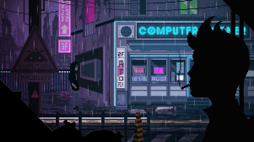

# Hi there 👋, I’m Mishu

  

---

## About Me

I’m an intermediate full-stack app developer passionate about building robust applications and continuously learning new technologies.  
I love to keep learning and improving my craft.

My recent work includes:

- **Trade X App**  
  A trading platform supporting 6,699 stocks, crypto, forex, etc., featuring auto-chart data generation and duel-mode trades.

- **Attendease App**  
  A lightweight Flutter app that converts student attendance logs into a polished PDF report.

---

## Connect with Me

  

---

## Languages & Tools

  
  
  
  
  
  
  
  

---

## GitHub Stats

